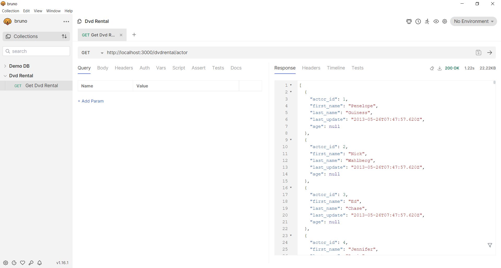

# Express JS and Database Integration

## Table of contents

- [Overview](#overview)
  - [The challenge](#the-challenge)
  - [Screenshot](#screenshot)
  - [Links](#links)
- [My process](#my-process)

## Overview

### The challenge
- Membuat aplikasi Express JS sederhana
- Mengintegrasikan postgreSQL database pada aplikasi Express
- Mengaplikasikan seeding dan migrasi database pada Express

### Screenshot

### Links

- Solution file: [solution_file](app.js)

## My process
- Restore database dvdrental
- Membuat aplikasi express.js dengan menginstall package yang dibutuhkan dan lakukan inisialisasi database pada express.js
- Lakukan routing menggunakan dynamic routing pada penampilan data spesifik

